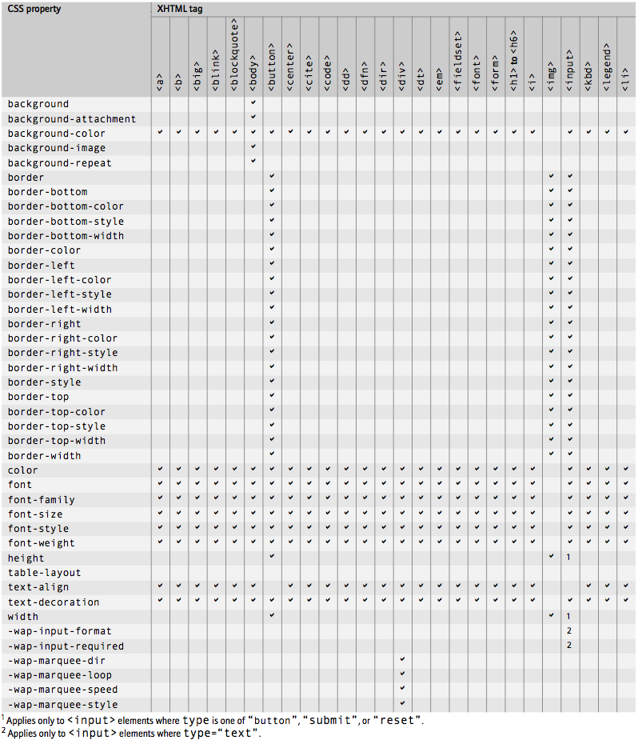
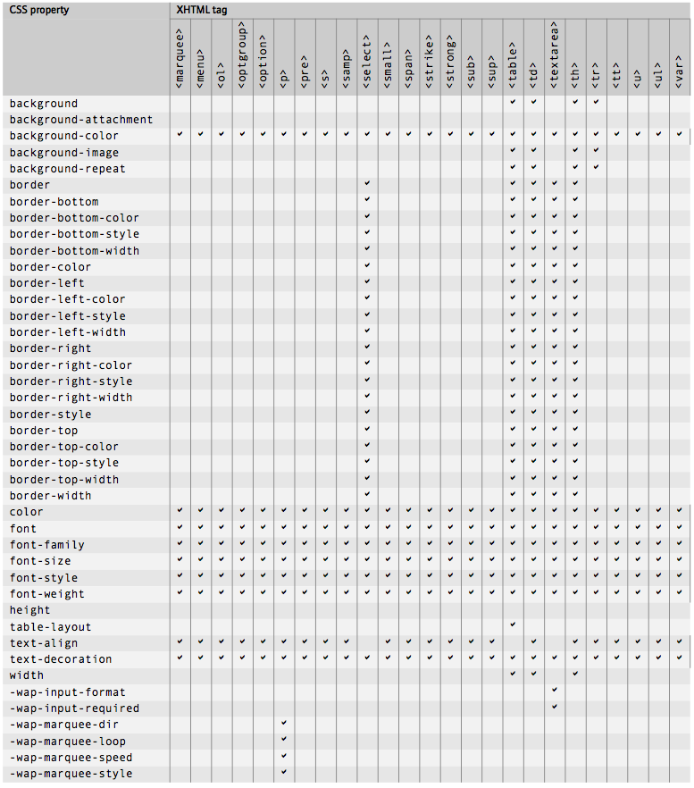

# BlackBerry CSS limitations

From the [BlackBerry Browser Version 4.2 Content Developer Guide](http://docs.blackberry.com/en/developers/deliverables/1143/browser_devguide.pdf) (p. 120-121)

## Element/CSS property matrix

## Element/CSS property matrix (continued)

